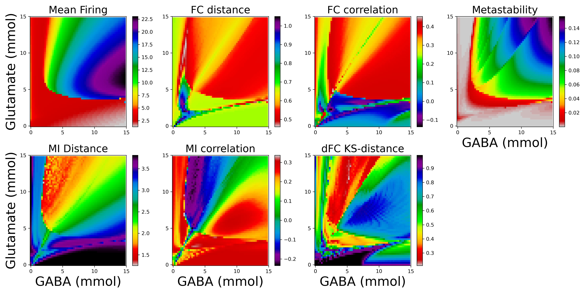

# MDMF Toolbox

## Introduction
A Python toolbox for analyzing brain network dynamics and fitting the MDMF model.


## Toolbox Summary

```plaintext
MDMF-Model-Toolbox/
│
├── images/
│   ├── toolbox_image1.png
│   ├── toolbox_image2.png
│   ├── toolbox_image3.png
│   ├── toolbox_image4.png
│
├── manuscript/
│   ├── code/
│   │   ├── Model_Fitting.py
│   │   ├── Resting_State_Networks.py
|   |
│   ├── __berlin__.zip # Contains phase space profiles for Berlin Dataset Subjects 
│   |
│   ├── images/
│   │   ├── IMG_20241029_202636.png
│   │   ├── Resting_State_Networks.py
|   |   ├── Skankey_Diagram.png
|   |   ├── phase_spaces.png
|
|   |   ├── optimal_paramters.csv # containing glutamate and gaba values for the berlin subjects
|
│── source-code/
│   ├── BOLD_model.py
│   ├── __init__.py        
│   ├── dynamic_functional_connectivity.py
│   ├── eucledian_distance.py
│   ├── functional_connectivity.py
│   ├── ks_distance_between_matrices.py
│   ├── linear_correlation.py
│   ├── mdmf_model.py
│   ├── metastability.py
│   ├── mutual_information.py
│   ├── phase_space.py
│   ├── subject_wise_parameters.py
│
│── tests/
│   ├── test.py            # (test script)
│
│── README.md              # (describes project)
│── requirements.txt       # (Lists dependencies)
│── setup.py               # (Making it an installable package)
│── docs/                  # (documentation)
|   │── INSTALLATION.md    
|   │── USAGE.md
|
|── LICENSE
```

## Features
- Uses **seven metrics** to fit the MDMF model to empirical data by least square distances algorithm.
- Visualizes **Firing rates, BOLD signals, structural connectivity (SC), functional connectivity (FC), mutual information (MI), and dynamic functional connectivity (dFC).**
- Explores **phase transitions of the MDMF model**, combined with the BOLD model, in the **GABA-Glutamate parameter space**.

## Visualization

### Visualizing Structural Connectivity matrix 

### Visualizing Modular Hierarchy in Structural Connectivity Matrix

### Subject-wise Phase Transitions in Parameter Space



## Installation

Clone the repository and install dependencies:

```bash
git clone https://github.com/im-vishalverma/MDMF-Model-Toolbox.git
cd MDMF-Model-Toolbox
pip install -r requirements.txt
```

## Usage

Import the toolbox and use its functions:

```python
import mdmf_toolbox as mt

# Compute Functional Connectivity
bold_data = ...  # Load BOLD time-series data
fc_matrix = mt.func_connec(bold_data, plot=1)

# Find optimal parameters in the GABA-Glutamate space
a, b = mt.find_parameters(Tglu_low=7.0, Tglu_high=9.0, Tgaba_low=0.2, Tgaba_high=0.5, discreteness=0.05, sc=sc_matrix, num_min=10.0, method='RK4')
```

## Dependencies
The toolbox requires the following dependencies:

- **NumPy**: For numerical operations
- **SciPy**: For scientific computing and statistical analysis
- **Matplotlib**: For visualization and plotting

Ensure all dependencies are installed using:

```bash
pip install -r requirements.txt
```

## Contributing
We welcome contributions! If you would like to contribute:

1. **Fork the repository** and clone your fork.
2. **Create a new branch** (`git checkout -b feature-branch`).
3. **Make your changes** and commit (`git commit -m "Add new feature"`).
4. **Push to your branch** (`git push origin feature-branch`).
5. **Submit a pull request** for review.

If you find a bug or have suggestions for improvement, feel free to open an issue.

## Citation
If you use this toolbox in your research, please consider citing it:

```
@misc{MDMFToolbox,
  author = {Vishal Verma, Priyanka Chakroborty, Dipanjan Roy},
  title = {MDMF Model Toolbox},
  year = {2025},
  url = {https://github.com/im-vishalverma/MDMF-Model-Toolbox}
}
```

## License
This project is licensed under the MIT License. See the `LICENSE` file for details.

---


